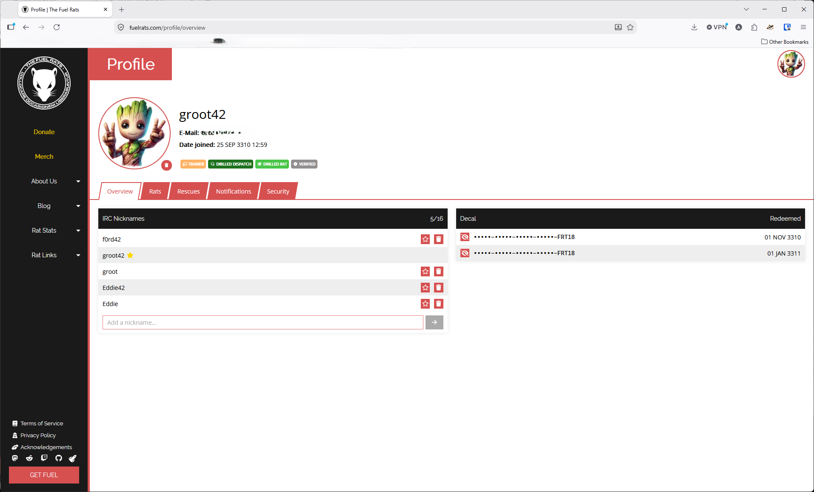
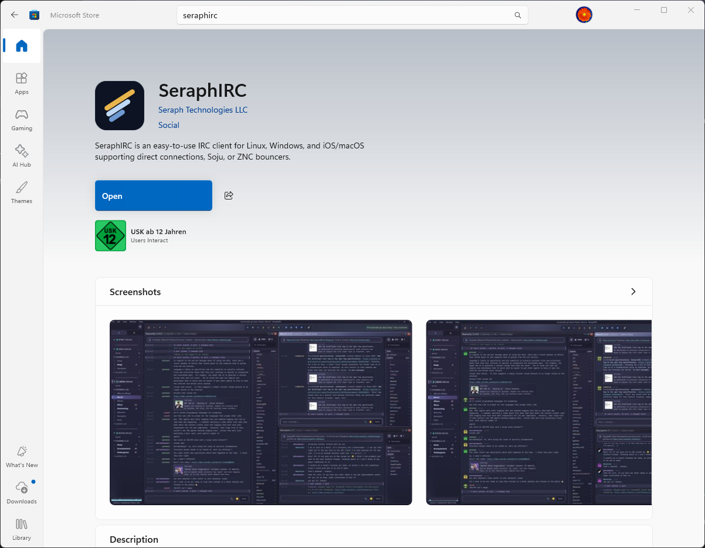
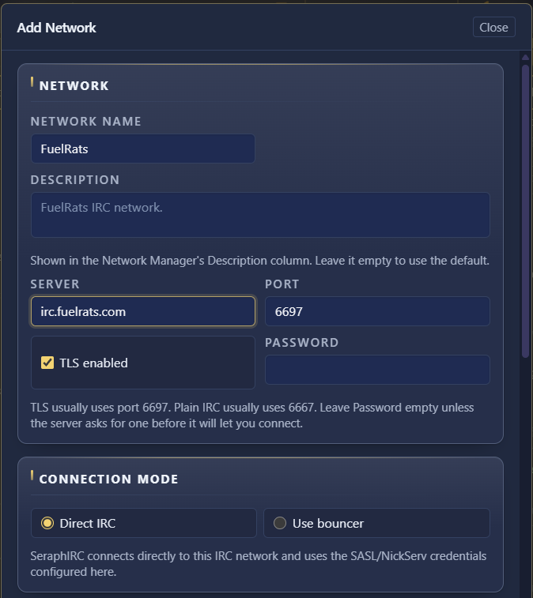
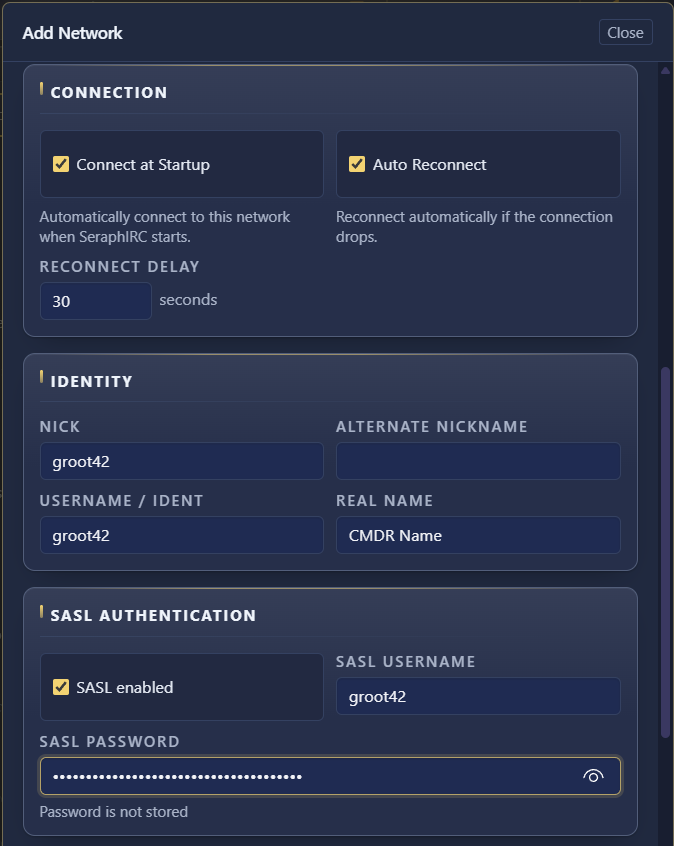
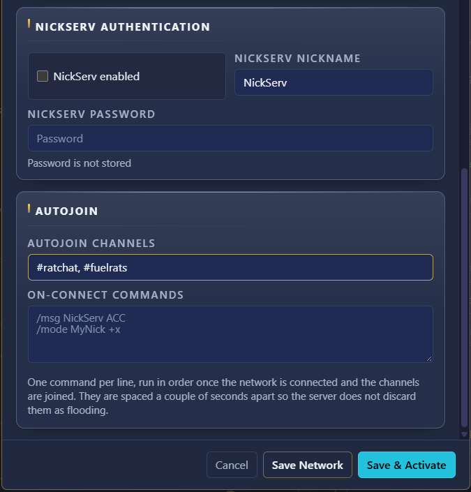
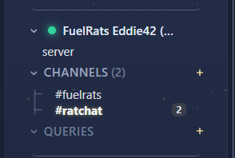
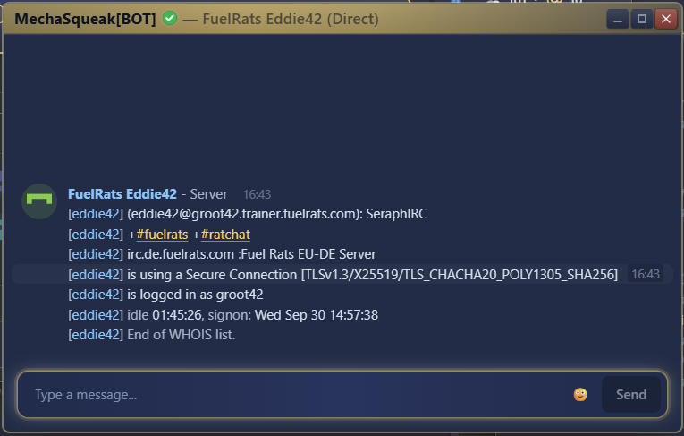
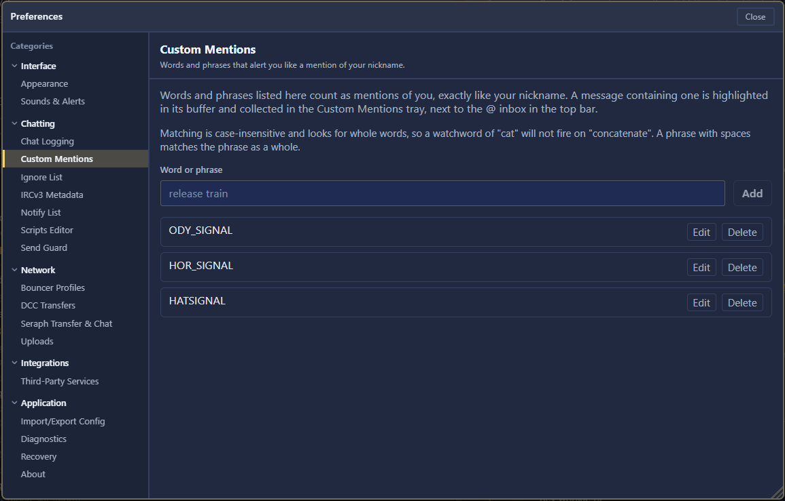
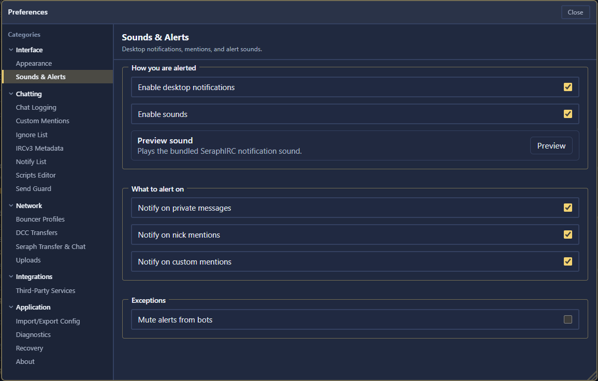

# SeraphIRC setup guide for the Fuel Rats

This guide sets up [SeraphIRC](https://www.seraphirc.chat/) on your computer and connects it **directly** to the Fuel Rats IRC network. Connecting through a bouncer (soju/ZNC) will be covered in a separate guide.

At the end you will be:

- connected to `irc.fuelrats.com` over an encrypted connection,
- identified automatically with your Fuel Rats account (SASL),
- in `#fuelrats` and `#ratchat` every time you start SeraphIRC,
- notified when a RATSIGNAL comes in.

---

## Contents

1. [Before you start](#1-before-you-start)
2. [Install SeraphIRC](#2-install-seraphirc)
3. [First start](#3-first-start)
4. [Add the Fuel Rats network](#4-add-the-fuel-rats-network)
5. [Connect and check you're identified](#5-connect-and-check-youre-identified)
6. [Recommended settings](#6-recommended-settings)
7. [Troubleshooting](#7-troubleshooting)
8. [Quick reference](#8-quick-reference)

---

## 1. Before you start

You need:

- **A Fuel Rats account** on [fuelrats.com](https://fuelrats.com).
- **A registered IRC nickname.** On the Fuel Rats network, nicknames are registered **on the website, not on IRC**. Go to [fuelrats.com → Profile → Overview](https://fuelrats.com/profile/overview) and add your nickname under **IRC nicknames**. Register your plain nickname first (e.g. `SomeRat`); variants with tags like `SomeRat[PC]` can be added afterwards.
- **Your fuelrats.com password.** It is also your IRC password. IRC doesn't accept every character in passwords: if yours contains spaces or unusual special characters, identifying will fail. In that case change your password on the website first.

> ⚠️ Do **not** use the NickServ `REGISTER` command on the Fuel Rats network. It doesn't work there.



---

## 2. Install SeraphIRC

The desktop versions are free.

| System | Where to get it |
| --- | --- |
| **Windows** | [Microsoft Store](https://apps.microsoft.com/store/detail/9NX6N61K61B0) (updates automatically) |
| **macOS** | `.dmg` from [GitHub releases](https://github.com/seraphirc/seraphirc-download/releases/latest) (signed and notarized) |
| **Linux** | `.deb`, `.rpm` or Flatpak from [GitHub releases](https://github.com/seraphirc/seraphirc-download/releases/latest). Arch users: [`seraphirc-bin`](https://aur.archlinux.org/packages/seraphirc-bin) in the AUR |
| **iPhone / iPad** | [App Store](https://apps.apple.com/us/app/seraphirc/id6787119413) (paid). Works best with a soju bouncer, see the bouncer guide (when available) |

Install it the usual way for your system and start SeraphIRC.



---

## 3. First start

On the first start, SeraphIRC offers a short **guided tour**. It shows where the settings are, the connection status indicator and the network list. It takes a minute and is worth doing once. You can also skip it.

After the tour, SeraphIRC opens the **Network Manager** (or a setup wizard). This is where networks are added. Networks are set up here, not with commands.


---

## 4. Add the Fuel Rats network

Open the **Network Manager**, add a **new** network and fill in the **Add Network** dialog as below. You can reopen the Network Manager later from the main menu.

### Network

| Field | Value |
| --- | --- |
| Network name | `FuelRats` (any name you like) |
| Description | optional, e.g. `FuelRats IRC network.` |
| Server | `irc.fuelrats.com` |
| Port | `6697` |
| TLS enabled | ✅ **on** |
| Password | leave **empty** |

Always use port `6697` with TLS, so your password is never sent unencrypted. Port `6667` without TLS also exists, ***but don't use it.***

If you have connection problems, you can also try the regional servers `irc.eu.fuelrats.com` or `irc.us.fuelrats.com` with the same settings.

### Connection mode

Choose **Direct IRC**. (**Use bouncer** is for soju/ZNC and will be covered in the bouncer guide.)



### Connection

| Field | Value |
| --- | --- |
| Connect at Startup | ✅ on, so SeraphIRC connects whenever it starts |
| Auto Reconnect | ✅ on |
| Reconnect Delay | `30` seconds (default) |

### Identity

| Field | Value |
| --- | --- |
| Nick | your registered IRC nickname, e.g. `SomeRat` |
| Alternate Nickname | another nickname **registered on your account**, e.g. `SomeRat[PC]`. Used if your nick is taken |
| Username / Ident | your nickname |
| Real Name | your CMDR name, or leave empty |

The real name is visible to everyone on IRC. Don't put your actual name there.

### SASL Authentication

SASL logs you in during the connection, before you join any channel. You don't have to type an identify command.

| Field | Value |
| --- | --- |
| SASL enabled | ✅ **on** |
| SASL Username | your account name: one of your registered IRC nicknames, usually the one marked with ⭐ on your profile |
| SASL Password | your fuelrats.com password |

SeraphIRC stores passwords in your operating system's password store (Windows Credential Manager, macOS Keychain, …), not in a plain text file.

**Note:** Support for certificate based authentication in direct connections is coming. We'll update this guide once available.



### NickServ Authentication

Leave **NickServ enabled** **off**. SASL already logs you in, so identifying a second time via NickServ isn't needed.

### Autojoin

| Field | Value |
| --- | --- |
| Autojoin Channels | `#fuelrats, #ratchat` (separated by a comma) |
| On-connect Commands | leave empty |

- **`#fuelrats`** is the rescue channel. Cases are handled here. Only talk there when you're part of a case.
- **`#ratchat`** is for everything else: chatting, questions, and asking for help.



Click **Save & Activate** to save the network and connect right away. (**Save Network** only saves it.)

---

## 5. Connect and check you're identified

After **Save & Activate**, SeraphIRC connects. A green dot next to the network name means you're connected, and after a few seconds `#fuelrats` and `#ratchat` appear under **Channels**.



**Check that you're identified.** Type in any window:

```
/whois SomeRat
```

(with your own nickname). Look for these lines:

- **`is logged in as <account>`**: you're identified. This is the important one.
- **The host** has the form `<account>.<role>.fuelrats.com`, e.g. `groot42.trainer.fuelrats.com`. Recruits get `recruit.fuelrats.com` until they're drilled.
- **`is using a Secure Connection`**: TLS is working.



**Signs that something went wrong:**

- **You were renamed to `rat_xxxx`.** You weren't identified. Check the SASL username and password (see [Troubleshooting](#7-troubleshooting)).
- **NickServ asks you to identify.** SASL didn't work. You can identify manually for now with `/msg NickServ identify <password>` in the server window, then fix the SASL settings.

---

## 6. Recommended settings

The settings are in the **Preferences** window.

### Get notified for RATSIGNALs

By default, SeraphIRC only alerts you when your own nickname is mentioned. Add the signal words as **custom mentions**:

1. Open **Preferences → Chatting → Custom Mentions**.
2. Enter a word under **Word or phrase** and click **Add**.

Which words to add depends on which signals you want:

| Word | Alerts you for |
| --- | --- |
| `RATSIGNAL` | every rescue signal |
| `ODY_SIGNAL` | PC Odyssey signals only |
| `HOR_SIGNAL` | PC Horizons signals only |
| `LEG_SIGNAL` | PC Legacy signals only |
| `XB_SIGNAL` | Xbox signals only |
| `PS_SIGNAL` | PlayStation signals only |


MechaSqueak ends every RATSIGNAL with one of these platform tags, e.g. `(ODY_SIGNAL)`. So if you can only take PC Odyssey and Horizons cases, add `ODY_SIGNAL` and `HOR_SIGNAL` instead of `RATSIGNAL`. Matching ignores upper/lower case and looks for whole words.



### Turn on desktop notifications

Open **Preferences → Interface → Sounds & Alerts**:

| Setting | Recommended |
| --- | --- |
| Enable desktop notifications | ✅ **on** (it's off by default) |
| Enable sounds | ✅ on |
| Notify on private messages | ✅ on |
| Notify on nick mentions | ✅ on |
| Notify on custom mentions | ✅ **on**, needed for signal alerts |
| Mute alerts from bots | ⬜ **off**. Signals come from MechaSqueak, which is a bot |

**Preview** plays the notification sound, so you can check it's audible.



### Keep Send Guard on

**Send Guard** (**Preferences → Chatting → Send Guard**) is on by default. It holds a message and asks first when it looks like a mistake, e.g. a password about to be sent to a channel, or a message going to the wrong window. Leave it on. `Ctrl+Enter` (macOS: `Cmd+Enter`) sends anyway when you're sure.

### Optional: less noise in #fuelrats

Right-click `#fuelrats` → **Buffer Settings**:

- **Focus Mode → Hide joins/parts/quits** hides the constant coming and going of clients and rats.
- **Buffer Alerts** stays on **Mentions only**, so signals (custom mentions) and your nickname alert, everything else doesn't.

---

## 7. Troubleshooting

**Can't connect at all**
- Check server `irc.fuelrats.com`, port `6697` and **TLS enabled** on. Port 6697 without TLS (or 6667 with TLS) doesn't work.
- Check that **Connection Mode** is **Direct IRC**.
- Try `irc.eu.fuelrats.com` or `irc.us.fuelrats.com`.
- Check whether a firewall or company network blocks port 6697.

**Renamed to `rat_xxxx` / not identified**
- Is **SASL enabled** checked?
- Is the nickname you connect with registered on [your profile](https://fuelrats.com/profile/overview)? The alternate nickname must be registered too.
- Is the SASL username your account name and the password your fuelrats.com password?
- Does your password contain spaces or unusual special characters? Change it on the website.
- Fuel Rats guide: [A Step-by-Step Guide to Identifying](https://confluence.fuelrats.com/display/public/FRKB/A+Step-by-Step+Guide+to+Identifying).

**Nickname already in use**
- Probably you're still connected from somewhere else, or an old connection hasn't timed out yet. SeraphIRC uses your alternate nickname in that case. Ask in `#ratchat` if it doesn't sort itself out.

**No signal alerts**
- Are your signal words in **Custom Mentions**, **Notify on custom mentions** on, and **Mute alerts from bots** off?
- Is **Enable desktop notifications** on, and are notifications allowed for SeraphIRC in your operating system's settings?
- Buffer Alerts for `#fuelrats` must not be **Off**.

**Still stuck?**
- Ask in `#ratchat`. If you can't connect with SeraphIRC, use the [Fuel Rats web client](https://kiwi.fuelrats.com:7778/) to get there.
- SeraphIRC help: [documentation](https://www.seraphirc.chat/docs/), `#seraphirc` on Libera.Chat. **Preferences → Application → Diagnostics** has the client's logs.

---

## 8. Quick reference

| | |
| --- | --- |
| Server | `irc.fuelrats.com` (or `irc.eu.fuelrats.com` / `irc.us.fuelrats.com`) |
| Port | `6697`, TLS enabled |
| Connection mode | Direct IRC |
| SASL | enabled, username = account name (registered IRC nickname), password = fuelrats.com password |
| NickServ | disabled (SASL does the login) |
| Channels | `#fuelrats` (rescues), `#ratchat` (everything else) |
| Register nicknames | [fuelrats.com → Profile → Overview](https://fuelrats.com/profile/overview), never with NickServ `REGISTER` |
| Check identification | `/whois <your nick>` → `is logged in as <account>` |
| Signal alerts | Preferences → Chatting → Custom Mentions |
| Scripts Editor | `Alt+R` |

**Sources:** [SeraphIRC website](https://www.seraphirc.chat/) and [documentation](https://www.seraphirc.chat/docs/), [Fuel Rats IRC FAQ](https://confluence.fuelrats.com/display/FRKB/IRC+FAQ), [Fuel Rats IRC Client Setup Guides](https://confluence.fuelrats.com/display/FRKB/IRC+Client+Setup+Guides).
